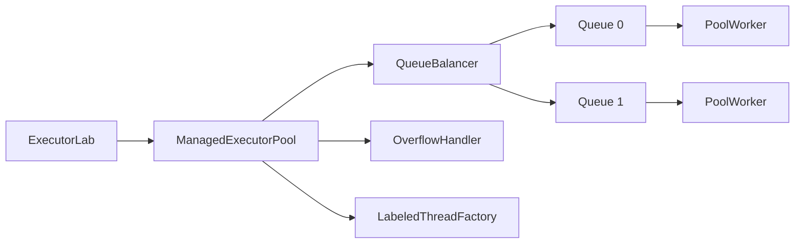

# lab1-executor — собственный пул потоков

## Запуск

```bash
# все сценарии + бенчмарк
./gradlew :lab1-executor:run

# только измерения производительности
./gradlew :lab1-executor:run --args="benchmark"
```

Демо включает три сценария:
1. **Steady workload** — 12 задач с `submit()`, graceful shutdown
2. **Queue overflow** — 25 задач в перегруженный пул (ожидается rejection)
3. **Graceful stop** — завершение с ожиданием активных задач

---

## Архитектура



| Компонент | Роль |
|-----------|------|
| `CustomExecutor` | Контракт API (требование задания) |
| `ManagedExecutorPool` | Реализация пула |
| `PoolWorker` | Поток, обрабатывающий свою очередь |
| `QueueBalancer` | Round Robin по per-worker очередям |
| `OverflowHandler` | Политики перегрузки |
| `ExecutorSettings` | Параметры пула (record + фабрика `of()`) |
| `LabeledThreadFactory` | Потоки `alex-pool-N` |
| `ExecutorEventLog` | Логирование событий |

### Round Robin

Каждый `PoolWorker` владеет `ArrayBlockingQueue`. `QueueBalancer` выбирает очередь циклически; если очередь полна — пробует следующую. При нехватке воркеров создается новый (до `maxPoolSize`).

### minSpareThreads

Если свободных воркеров меньше `minSpareThreads`, пул добавляет потоки заранее — даже при низкой нагрузке.

### Idle timeout

`PoolWorker` ждет задачу через `poll(keepAliveTime)`. Если таймаут и `workers > corePoolSize` — поток завершается.

---

## Политика перегрузки: ABORT

При заполнении всех очередей и достижении `maxPoolSize` — `RejectedExecutionException`.

**Почему ABORT:** клиент сразу узнает о перегрузке и может применить retry или backpressure. Это предсказуемее, чем молчаливое накопление задач.

**Минус:** задача теряется без встроенного retry. Альтернатива `CALLER_RUNS` блокирует вызывающий поток.

На демо overload: **accepted=6, rejected=19** (при `core=2, max=2, queueSize=2`).

Демо steady workload: `Shutdown result: true, workers left: 0`. Graceful stop: `true, workers left: 0`.

---

## Бенчмарк

Условия: 500 задач × 10 ms sleep, `core=4, max=8, queueSize=150`.

**Результаты прогона 13.06.2026** (`./gradlew :lab1-executor:run`, лог в `logs`):

| Реализация | Throughput | Avg latency |
|------------|------------|-------------|
| ManagedExecutorPool | **342.19** tasks/sec | **11.05** ms |
| ThreadPoolExecutor (JDK) | **343.43** tasks/sec | **11.13** ms |

Разница в throughput менее 0.4% — на данной машине реализации показывают практически одинаковую скорость. JDK-пул чуть быстрее за счет единой очереди; кастомный пул дает изоляцию нагрузки через per-worker очереди.

Throughput считается до завершения всех `Future`, без ожидания shutdown.

### Подбор параметров (200 задач × 10 ms)

| core | max | queueSize | Throughput |
|------|-----|-----------|------------|
| 2 | 4 | 50 | **339.55** |
| 4 | 8 | 50 | **345.18** |
| 8 | 16 | 50 | **684.87** |

**Выводы:**
- Для IO-bound задач (sleep) throughput растет с числом потоков
- Переход 2→4 потоков дает прирост ~1.7%
- При 8 потоках — удвоение (~685 vs ~340 tasks/sec), потоки большую часть времени ждут в sleep
- Для CPU-bound оптимум ближе к числу ядер
