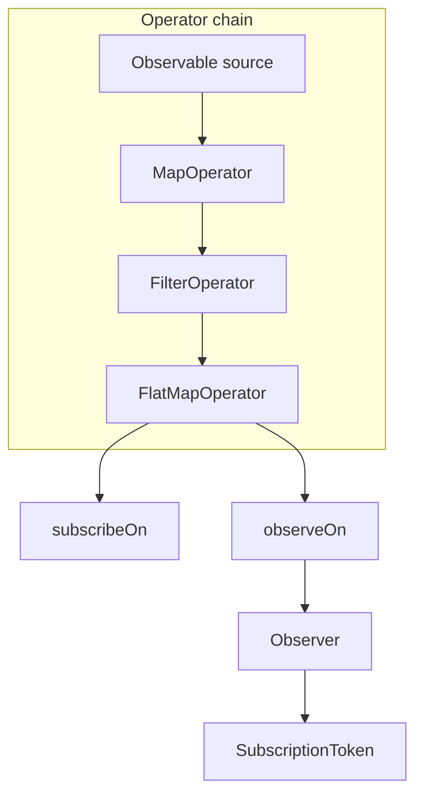

# lab2-reactive — учебная реактивная библиотека

Мини-реализация идей RxJava: Observer-паттерн, ленивые операторы, schedulers, отмена подписок.

## Запуск тестов

```bash
./gradlew :lab2-reactive:test
```

18 тестов, 11 тест-классов.

---

## Архитектура



### Публичный API

| Тип | Методы |
|-----|--------|
| `Observer<T>` | `onNext`, `onError`, `onComplete` |
| `Observable<T>` | `create`, `subscribe`, `map`, `filter`, `flatMap`, `subscribeOn`, `observeOn` |
| `Disposable` | `dispose`, `isDisposed` |
| `Scheduler` | `execute` |
| `Schedulers` | `io()`, `computation()`, `single()` |

### Внутренние компоненты

| Класс | Назначение |
|-------|-----------|
| `StreamEmitter` | Фабрика для `Observable.create()` |
| `MapOperator` / `FilterOperator` / `FlatMapOperator` | Операторы преобразования |
| `SchedulerProvider` | IO, computation, single schedulers |
| `SubscriptionToken` | Токен отмены подписки |
| `SubscriptionRegistry` | Реестр вложенных подписок |
| `GuardedObserver` | Защита от повторных terminal-событий |
| `ObserveOnWrapper` | Перенос доставки на scheduler |

### Жизненный цикл подписки

1. `subscribe()` создает `SubscriptionToken` и оборачивает observer в `GuardedObserver`
2. При `observeOn` — события маршрутизируются через `ObserveOnWrapper`
3. Подключение к source выполняется в потоке `subscribeOn` (если задан)
4. `dispose()` отменяет все подписки в `SubscriptionRegistry`

---

## Schedulers

| Scheduler | Пул | Потоки | Когда использовать |
|-----------|-----|--------|-------------------|
| `Schedulers.io()` | CachedThreadPool | `alex-io-N` | Блокирующий IO (сеть, файлы) |
| `Schedulers.computation()` | FixedThreadPool(cores) | `alex-compute-N` | Вычисления, парсинг |
| `Schedulers.single()` | SingleThreadExecutor | `alex-single-N` | Строгий порядок выполнения |

**subscribeOn** — переносит вызов `subscribe()` (подключение к source) в указанный scheduler.

**observeOn** — переносит доставку `onNext/onError/onComplete` подписчику.

Типичная цепочка:

```java
Observable.<Data>create(src -> fetch(src))
    .subscribeOn(Schedulers.io())
    .map(this::parse)
    .observeOn(Schedulers.computation())
    .subscribe(observer);
```

---

## Примеры

### Базовая подписка

```java
Observable.<String>create(emitter -> {
    emitter.onNext("alpha");
    emitter.onNext("beta");
    emitter.onComplete();
}).subscribe(new Observer<String>() {
    public void onNext(String s) { System.out.println(s); }
    public void onError(Throwable t) { t.printStackTrace(); }
    public void onComplete() { System.out.println("done"); }
});
```

### Цепочка операторов

```java
Observable.<Integer>create(e -> {
    for (int i = 1; i <= 5; i++) e.onNext(i);
    e.onComplete();
})
.map(n -> n * n)
.filter(n -> n > 4)
.subscribe(observer); // 9, 16, 25
```

### Отмена

```java
Disposable token = Observable.<Integer>create(emitter -> {
    for (int i = 1; i <= 100; i++) {
        emitter.onNext(i);
        Thread.sleep(50);
    }
    emitter.onComplete();
})
.subscribeOn(Schedulers.single())
.subscribe(observer);

token.dispose();
```

---

## Тестирование

| Класс | Что проверяет |
|-------|---------------|
| `StreamCreationTest` | `create()`, базовая эмиссия |
| `MapOperatorTest` | `map` |
| `FilterOperatorTest` | `filter`, пустой результат |
| `FilterFailureTest` | ошибка в predicate |
| `FlatMapOperatorTest` | слияние вложенных потоков |
| `FlatMapFailureTest` | ошибка во inner-потоке |
| `SchedulerProviderTest` | три scheduler'а, имена потоков |
| `SchedulerRoutingTest` | `subscribeOn`, `observeOn` по отдельности |
| `SchedulerChainTest` | `subscribeOn` + `observeOn` вместе |
| `StreamErrorTest` | ошибки source/map, единственный `onError` |
| `SubscriptionCancellationTest` | `dispose()` останавливает доставку |

```bash
./gradlew :lab2-reactive:test
```
